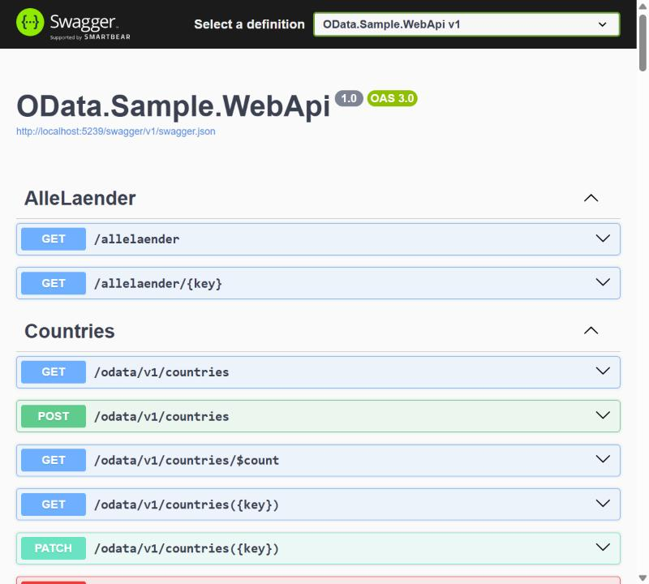
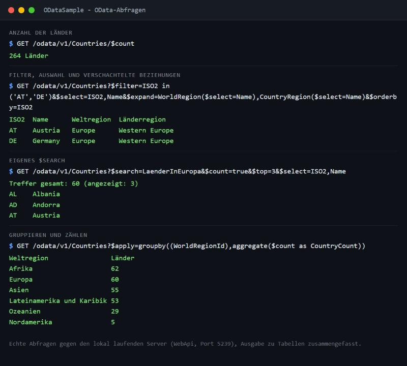

# ODataSample

An end-to-end OData v4 sample in .NET 8:

- **OData.Sample.WebApi**: an ASP.NET Core OData server with EF Core and SQLite, seeded with world regions, country regions and countries.
- **OData.Sample.Client**: a console app that uses an OData Connected Service proxy to run typed LINQ queries and CRUD operations against the server.

## Contents

- [Screenshots](#screenshots)
- [Repository layout](#repository-layout)
- [Requirements](#requirements)
- [Getting started](#getting-started)
- [The OData service](#the-odata-service)
- [Query examples](#query-examples)
- [The console client](#the-console-client)
- [Configuration](#configuration)
- [Tech stack](#tech-stack)
- [License](#license)

## Screenshots



*Swagger UI (Development profile only): the controllers under `odata/v1` plus the plain `AlleLaender` controller for comparison.*



*Real requests against the locally running server (output condensed into tables). The `$search` term `LaenderInEuropa` is the custom search described below.*

## Repository layout

| Path | Description |
| :--- | :--- |
| `data/` | JSON seed data (`WorldRegions`, `CountryRegions`, `Countries`), embedded into the WebApi assembly |
| `doc/Help/` | OData query options cheat sheet (PDF) |
| `doc/Postman/` | Postman collections for this API and the public odata.org services |
| `shell/` | `ServerStart.cmd` / `ClientStart.cmd` launch scripts |
| `src/WebApi/` | OData server (`OData.Sample.WebApi`) |
| `src/Client/` | Console client (`OData.Sample.Client`) |
| `ODataSample.sln` | Solution containing both projects |

## Requirements

- [.NET 8 SDK][NET8]
- [EF Core CLI tools][EFTools], needed once to create the database migration: `dotnet tool install --global dotnet-ef`
- Optional: [Visual Studio 2022][VS2022] or [VS Code][VSCode]
- Optional: the [OData Connected Service 2022+][VSOdataExt] extension, only needed if you want to regenerate the client proxy

## Getting started

### 1. Build

```shell
dotnet build ODataSample.sln
```

### 2. Create the database migration (first run only)

The server applies EF Core migrations and reseeds the SQLite database at startup. The repository doesn't include a migrations folder, so create the initial migration once:

```shell
cd src/WebApi
dotnet ef migrations add Initial
```

The design-time factory (`ODataSampleContextDesignFactory`) reads its connection string from `migrationsettings.json`.

### 3. Trust the development certificate

The server and client use HTTPS on `localhost`:

```shell
dotnet dev-certs https --trust
```

### 4. Run the server

```shell
dotnet run --project src/WebApi
```

On startup the server:

1. applies migrations to `ZSQLite.db` in the WebApi folder,
2. deletes all existing rows and reseeds them from the embedded `data/*.json` files.

All data changes are lost on every restart.

The server listens on:

| URL | Purpose |
| :--- | :--- |
| `https://localhost:7239/odata/v1` | OData service root |
| `https://localhost:7239/odata/v1/$metadata` | CSDL metadata |
| `https://localhost:7239/$odata` | OData route debug page |
| `https://localhost:7239/swagger` | Swagger UI (Development only) |

HTTP is available on `http://localhost:5239`.

### 5. Run the client

With the server running, in a second terminal:

```shell
dotnet run --project src/Client
```

The scripts in `shell/` do the same with `--no-build`, so build first and run them from inside `shell/`.

## The OData service

The EDM model (`src/WebApi/Domain/EdmModel/CountriesEdmModel.cs`) exposes three entity sets under `odata/v1`:

| Entity set | Navigation properties | Server page size |
| :--- | :--- | :--- |
| `WorldRegions` | `CountryRegions`, `Countries` | 10 |
| `CountryRegions` | `WorldRegion`, `Countries` | 10 |
| `Countries` | `CountryRegion`, `WorldRegion` | none |

Each set supports `GET` (collection and by key), `POST`, `PATCH`/`PUT` (using `Delta<T>`) and `DELETE`.

All query options are enabled: `$select`, `$expand`, `$filter`, `$orderby`, `$top`, `$skip`, `$count`, `$apply` and `$search`.

### Custom `$search`

`CountrySearchBinder` maps a few search terms on `Countries` to world-region filters:

| Term | World region |
| :--- | :--- |
| `LaenderInAfrika` | Africa |
| `LaenderInCaribic` | Caribbean |
| `LaenderInAmerika` | America |
| `LaenderInEuropa` | Europe |
| `LaenderInOzeanien` | Oceania |
| `LaenderInAsien` | Asia |

Any other single search term returns an error.

### Plain Web API controller

`AlleLaenderController` is a regular, non-OData ASP.NET Core controller at `/allelaender` and `/allelaender/{id}`. You can compare it with the OData `Countries` endpoint in Swagger.

## Query examples

Base URL: `https://localhost:7239/odata/v1`

```text
# Select fields, filter, sort
/Countries?$select=ISO2,ISO3,Name&$filter=ISO2 in ('AT','DE','IT')&$orderby=ISO3

# Single entity by key
/Countries(40)

# Expand related entities, including nested expand
/Countries?$expand=WorldRegion,CountryRegion($expand=WorldRegion)&$filter=ISO2 eq 'AT'

# Filter with a string function, include total count
/Countries?$filter=startswith(Name,'A')&$count=true

# Count only
/Countries/$count

# Group and aggregate
/Countries?$apply=groupby((WorldRegionId),aggregate($count as CountryCount))

# Custom search
/Countries?$search=LaenderInEuropa
```

`doc/Postman/OData.Sample.WebApi.Postman.json` contains a ready-made collection covering select, expand, filter, count, groupby, custom search and CRUD. Import it into Postman to try them.

## The console client

The client (`src/Client/Program.cs`) shows a menu. Press a number key to run a command:

| Key | Command | What it shows |
| :--- | :--- | :--- |
| 1 | Get countries | LINQ `Where` + `OrderBy` translated to `$filter` / `$orderby` |
| 2 | Get countries expanded regions | `Expand`, including a nested `$expand` |
| 3 | Get countries grouped | Grouping and counting by world region |
| 4 | Add new country | `AddToCountries` + `SaveChanges` (fake data from AutoBogus) |
| 5 | Update country AT | Load, modify, `UpdateObject` + `SaveChanges` |
| 6 | Delete country in Afrika | `DeleteObject` + `SaveChanges` |

The service root is hard-coded as `ServiceRoot` in `Program.cs`. To add a command, implement `IOdataCommand` in `src/Client/Commands/` and register it in the `commands` array.

### Regenerating the proxy

The typed proxy lives in `src/Client/Connected Services/ODataSampleService/`. After changing the server's EDM model, run the server, then right-click the service in Visual Studio and choose **Update OData Connected Service**. This requires the OData Connected Service extension.

## Configuration

`src/WebApi/appsettings.json`:

```json
{
  "DbSettings": {
    "ConnectionString": "Data Source=ZSQLite.db",
    "DoMigrations": true,
    "DoSeeding": true
  }
}
```

| Setting | Effect |
| :--- | :--- |
| `ConnectionString` | SQLite database file, relative to the working directory |
| `DoMigrations` | Apply EF Core migrations at startup |
| `DoSeeding` | Delete all rows and reseed from `data/*.json` at startup |

Set `DoSeeding` to `false` to keep changes across restarts.

## Tech stack

- [ASP.NET Core OData 9][AspNetOData] on [.NET 8][NET8]
- [EF Core 8][EFCore] with the [SQLite][SQLite] provider
- [Microsoft.OData.Client 8][ODataClient] (Connected Service proxy)
- [Serilog][Serilog] for logging
- [Polly][Polly] for retry policies
- [Swashbuckle][Swashbuckle] for Swagger
- [Spectre.Console][Spectre] and [AutoBogus][AutoBogus] in the client

## License

[CC0 1.0 Universal](LICENSE)

[NET8]: https://dotnet.microsoft.com/en-us/download/dotnet/8.0
[EFTools]: https://learn.microsoft.com/en-us/ef/core/cli/dotnet
[EFCore]: https://github.com/dotnet/efcore
[AspNetOData]: https://github.com/OData/AspNetCoreOData
[ODataClient]: https://github.com/OData/odata.net
[SQLite]: https://www.sqlite.org/
[Serilog]: https://serilog.net/
[Polly]: https://github.com/App-vNext/Polly
[Swashbuckle]: https://github.com/domaindrivendev/Swashbuckle.AspNetCore
[Spectre]: https://spectreconsole.net/
[AutoBogus]: https://github.com/nickdodd79/AutoBogus
[VS2022]: https://visualstudio.microsoft.com/
[VSCode]: https://code.visualstudio.com/
[VSOdataExt]: https://marketplace.visualstudio.com/items?itemName=marketplace.ODataConnectedService2022

## Dependency updates

Packages were updated within .NET 8 to remove known vulnerabilities (checked with `dotnet list package --vulnerable --include-transitive`). The unused `AutoMapper` packages were removed. Behaviour and endpoints are unchanged.
